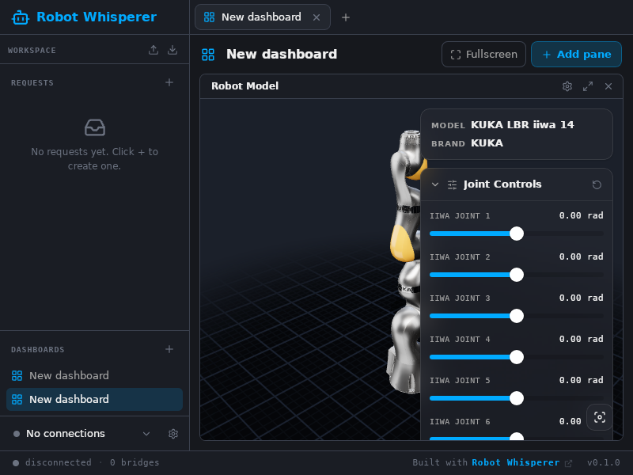

# Linux distribution: Ubuntu 20.04, 22.04 and 24.04

Robot Whisperer is a Tauri 2 app, and Tauri 2 renders through the **system**
WebKitGTK. This document records why that breaks on Ubuntu 20.04, how the snap
fixes it, and how each artifact was actually verified — not "it built", but "it
launched and drew the UI".



_The snap on an Ubuntu 20.04 host: a dashboard with the 3D robot pane, driven
through WebDriver and captured from the running app._

## Why 20.04 breaks

Tauri 2.11 / wry 0.55 resolve `webkit2gtk-sys 2.0.2` + `soup3` — the
**webkit2gtk-4.1** flavour. Tauri 2 has no 4.0 fallback. Measured against the
Ubuntu archive:

| Suite                                | `libwebkit2gtk-4.1-0`              | `libwebkit2gtk-4.0-37` |
| ------------------------------------ | ---------------------------------- | ---------------------- |
| focal (20.04), main **and universe** | **absent**                         | present                |
| jammy (22.04), universe              | present — 2.50.4 via jammy-updates | present                |
| noble (24.04), main                  | present — 2.52.3                   | absent                 |

So on 20.04 the deb is not merely broken, it is uninstallable. Reproduced in a
real focal root filesystem:

```
$ apt-get install ./robot-whisperer_0.1.0_amd64.deb
The following packages have unmet dependencies:
 robot-whisperer : Depends: libwebkit2gtk-4.1-0 but it is not installable
```

The only fix is for the app to bring its own engine. That is what a snap does.

## The snap

`snap/snapcraft.yaml`, following Tauri's official recipe. `base: core22` is the
whole trick: a strictly-confined snap runs against the core22 (22.04) runtime
that snapd provides on **every** host, plus the libraries it stages itself. The
host contributes only the kernel. One snap therefore covers 20.04, 22.04 and
24.04 with no per-distro variants.

Three details are load-bearing:

- **`layout:` binding `/usr/lib/$SNAPCRAFT_ARCH_TRIPLET/webkit2gtk-4.1`.**
  WebKitGTK launches `WebKitWebProcess` by absolute path. Without the bind it
  cannot start a web process and the window comes up blank with no error.
- **`network-bind`.** The app runs a loopback WebSocket to stream decoded frames
  into the webview's worker. Without this plug the bind is refused and no
  telemetry ever reaches the UI.
- **`stage-packages: [libwebkit2gtk-4.1-0]`.** The engine itself, from
  jammy-updates (2.50.4).

### core22 rather than core22 + core24

core24 carries WebKitGTK 2.52 against core22's 2.50 — a point release. The
thing that actually governs 3D performance, the GPU userspace, does not come
from the base at all: snapd supplies it via the `opengl` plug and the
`graphics-core22` provider, which maps the _host's_ Mesa/driver stack in. A
core24 snap would render through the same driver on the same machine, so the
second build lane buys nothing.

## What ships where

| Format                   | 20.04 | 22.04 | 24.04 | Size                  |
| ------------------------ | ----- | ----- | ----- | --------------------- |
| **snap** (core22)        | ✅    | ✅    | ✅    | ~72 MB                |
| deb, built on jammy      | ✗     | ✅    | ✅    | 12 MB                 |
| deb, built on noble      | ✗     | ✗     | ✅    | 12 MB                 |
| AppImage, built on jammy | ✗     | ✅    | ✅    | 86 MB                 |
| flatpak                  | ✅    | ✅    | ✅    | not built — see below |

The deb and AppImage genuinely cannot serve 20.04: there is no webkit2gtk-4.1
there to depend on, and an AppImage additionally carries its build host's glibc
(jammy's 2.35, against focal's 2.31). **20.04 users get the snap.**

The AppImage is built on jammy deliberately. Built on noble it would require
glibc 2.39 and fail on 22.04.

## Bugs this work found and fixed

Three real defects, all of which shipped on `main`:

1. **The app did not start under a POSIX locale.** WebKitGTK reports
   `navigator.language === "C"` when the locale is `C`/`C.UTF-8`/unset. That is
   not a valid BCP-47 tag, and uPlot does `new Intl.NumberFormat(navigator.language)`
   at module scope, so the bundle throws while evaluating and the whole UI dies
   on SvelteKit's error page. Chromium normalises "C" silently, which is why
   this never showed up in a browser. `ensure_usable_locale()` in
   `src-tauri/src/lib.rs` now supplies a usable default when — and only when —
   there is effectively no locale. Containers, CI runners, servers and confined
   snaps all routinely land on `C`.

2. **A failed boot reported nothing useful.** SvelteKit replaces any uncaught
   client error with a bare "500 / Internal Error", and the desktop shell has no
   devtools and no console on stdout. `src/hooks.client.ts` now surfaces the
   real error; it is what turned bug 1 from a blank window into a one-line
   diagnosis.

3. **The ingest socket failed silently.** `ingest_ws.rs` logged and returned if
   its `TcpListener::bind` failed, leaving the port unset — the app opened and
   streamed nothing. That is exactly the symptom of a snap missing
   `network-bind`. The failure is now recorded and reported to the frontend,
   naming the interface.

Two smaller fixes: `tauri.conf.json` never listed the 512×512 icon that exists
on disk (so generated icon sets topped out at 256), and `vite/urdf-manifest.ts`
wrote entries in `readdir` order, so the committed `manifest.json` churned on
every machine.

## How this was verified

No snapd is available in the build environment (PID 1 is not systemd) and the
container registry is blocked, so verification used real Ubuntu root
filesystems built with `debootstrap` from `archive.ubuntu.com`.

**The 20.04 proof.** A strictly-confined snap executes with the core22 snap as
`/`; the host userspace is never consulted. That namespace is reproduced
directly: the core22 root filesystem and the assembled snap payload are placed
_inside_ the focal root filesystem, and the app is launched through a nested
chroot — 20.04 host → core22 runtime → app. `scripts/run-snap-tree.sh`
reproduces snapd's library resolution and the `layout` bind.

Critically, the core22 root filesystem used for testing has **no
`libwebkit2gtk` installed at all**, so a successful launch proves the snap is
carrying its own engine rather than borrowing one.

**Rendering, not just starting.** A Tauri app whose web process fails still
shows a window — it is simply empty. Every run therefore ends in a screenshot
that `scripts/analyse-screenshot.py` checks for colour diversity and edge
density. The thresholds are calibrated against two real captures from this app:
SvelteKit's error page scores 326 colours / 1.17% edges, the working UI scores
1447 / 2.80%. An earlier, laxer threshold passed the error page, which made the
check worse than useless — it reported success on a dead app.

**The 3D dashboard.** `scripts/ui-drive.py` drives the running app through
`tauri-driver` (Tauri's official WebDriver harness) over WebKitWebDriver, using
real WebDriver element clicks rather than `element.click()`. It creates a
dashboard, adds the Robot Model pane, screenshots it, and reports the live
canvas contexts (`534x431 ctx=webgl`).

### Results

| Run                         | Host                                                  | Verdict                     |
| --------------------------- | ----------------------------------------------------- | --------------------------- |
| snap payload                | Ubuntu 20.04 (glibc 2.31, no webkit2gtk-4.1 anywhere) | RENDERED                    |
| snap payload + 3D dashboard | Ubuntu 20.04                                          | RENDERED, WebGL canvas live |
| snap payload                | core22, no webkit installed                           | RENDERED                    |
| snap payload                | Ubuntu 24.04                                          | RENDERED                    |
| deb                         | Ubuntu 22.04                                          | RENDERED                    |
| deb                         | Ubuntu 24.04                                          | RENDERED                    |
| AppImage                    | Ubuntu 22.04                                          | RENDERED                    |
| AppImage                    | Ubuntu 24.04                                          | RENDERED                    |
| deb (from `main`, unfixed)  | Ubuntu 20.04                                          | uninstallable, as expected  |

### Reproducing

```shell
# in each target root filesystem
scripts/verify-launch.sh <label> <outdir> /usr/bin/robot-whisperer
scripts/verify-launch.sh <label> <outdir> scripts/run-snap-tree.sh /path/to/prime

# UI automation (needs tauri-driver and webkit2gtk-driver)
RW_APP=/usr/bin/robot-whisperer scripts/ui-drive.py dashboard3d out.png
```

## Caveats

- **GPU performance is unmeasured.** These runs are headless on llvmpipe. The
  checks prove the WebGL context initialises and the robot draws; they say
  nothing about frame rate on real hardware.
- **The snap was assembled, not built by snapcraft.** snapd cannot run in this
  environment, so the payload was staged exactly as snapcraft would (the stage
  set was computed by asking apt what a core22+GNOME base is missing) and
  squashed by hand. `snap/snapcraft.yaml` is the artifact to ship; run
  `snapcraft` on a machine with snapd to produce the canonical `.snap`. The
  hand-assembled one lacks the `gnome` extension's runtime wiring.
- **Confinement is not fully reproduced.** The chroot models snapd's mount
  namespace and library resolution, not AppArmor. A wrong plug could still only
  surface on a real snapd host, which is why the plug list is explicit.
- **The flatpak manifest is unbuilt.** flathub is unreachable from this
  environment, so `packaging/flatpak/` has never been through `flatpak-builder`.
  It is a starting point, not a verified artifact.
